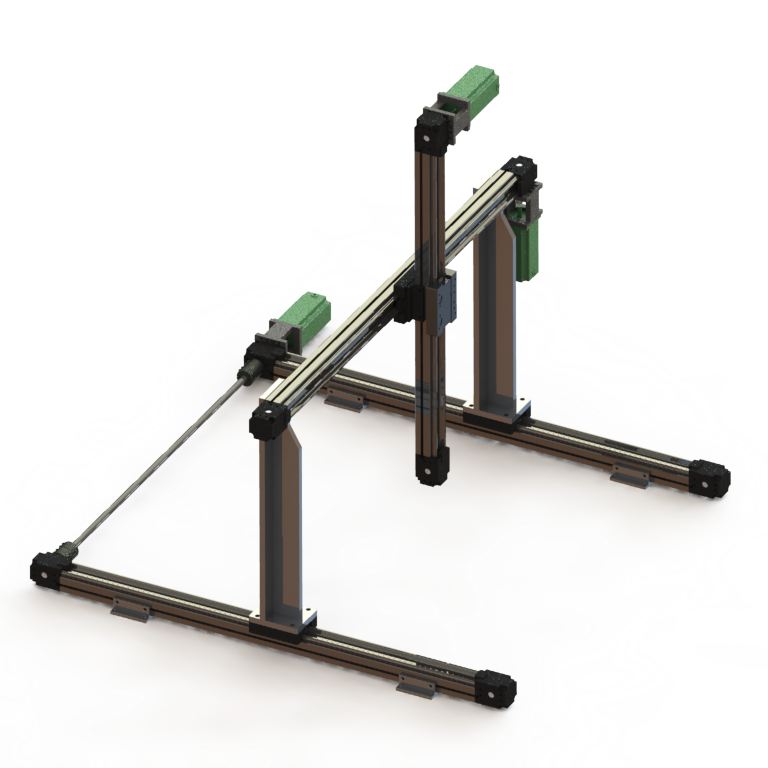

# Aris XYZ Platform

## Introduction

Course project of ME337 Advanced Actuation for Robots at SUSTech.

## Hardware

- Step motors
- 3-axis platform
- Industrial Personal Computer
- EtherCat communication
- Soft acuator and gripper

<a href="images/xyz_demo.mp4">Video</a>




## Soft Acuator and Gripper
<p float="left">


</p>

## Trapezoidal Speed Planner

- Optimal time trapezoidal planning
- Given time trapezoidal planning
- Trapezoidal to triangular velocity profile
- Time synchronization for 3-axis platform


## Conventions

```
_________
|   |   |
|  END  |
|   |   |
|_(0,0)_|
| 1 | 2 |
|   5   |
| 3 | 4 |
---------
x ^
  |__> y
```

## Commands

| Key        | Description                          |
|:----------:|:-------------------------------------|
| W, A, S, D | Move a small distance in `XY`        |
| 1, 2, 3, 4 | Move `XY` to predefined grid points  |
| C          | Lift gripper to initial `Z` position |
| F          | Drop down gripper in `Z`             |
| G          | Lift up gripper in `Z`               |
| E          | Pick and place all in one            |
| R          | Return gripper to zero `XYZ` position|

## Example
```bash
c               # lift Z to initial pos and record this XYZ pos as (0,0)
1 / 2 / 3 / 4   # move gripper to predefined point
w / a / s / d   # fine tune XY position
f/g             # drop or lift Z
e               # pick and place
r               # return to (0,0)
```

## Dependencies

- [Aris 1.5.0](https://github.com/py0330/aris)
- EtherCat
